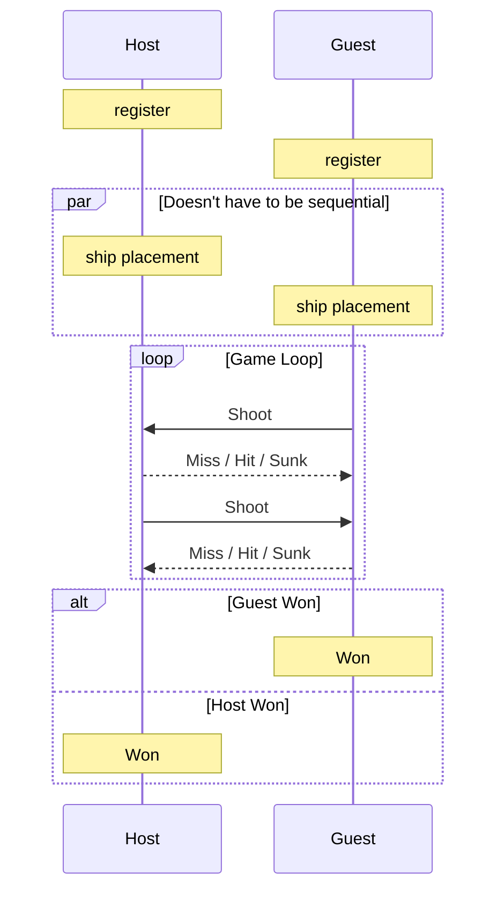

# 🚢 IoT Battleship

An Embedded Software Battleship game.

---

## 🛠️ Architecture

This project runs on some modular independent boards and a MQTT Broker / Game Manager.

### 🎮 The Board

#### 🔌 Hardware

A single board is composed of:

- **ESP32-WROOM-32** development board
- **Adafruit NeoPixel 8x8 RGB** Led Matrix
- **Analog Joystick**
- **Development breadboard**
- **Jumper wires**

#### 💻 Software

Each board is programmed using **Arduino IDE** and the **Arduino programming language** utilizing various libraries to simplify:
- the LED matrix usage
- the WIFI/MQTT communication
- json serialization/deserialization

---

### 🖥️ The MQTT Broker / Game Manager

#### 🔌 Hardware

Literally just a **Raspberry Pi 5 (8GB Model)**.

#### 💻 Software

The MQTT Broker we used is **mosquitto** and the Game Manager was built on **Rust** using:
- `rumqttc` for MQTT communication
- `serde` for serialization/deserialization
- `tokio` for parallelization

---

## 📂 Project layout

The project is divided into two repositories: one for the code that is run on the ESP32 boards and one run on the Raspberry Pi MQTT Broker / Game Manager.

### 🔌 ESP32 Repository

This repository contains the Arduino/C++ firmware that runs on each board, structured as follows:
- **`Battleship_ESP32.ino`**: Entry point that boots the board and runs the interface loop.
- **`interface` module** (`interface.*`): Drives the game loop, renders the LED matrix, and reads the analog joystick.
- **`battle` facade** (`battle.*`): Exposes a synchronous game-logic API to the interface; WiFi/MQTT run on a dedicated core so blocking calls never drop the connection.
- **`game_state` module** (`game_state.*`): Holds the in-memory board state (own and enemy grids), updated from server events and read by the display.
- **`protocol` module** (`protocol.*`): Handles JSON serialization/deserialization of the messages exchanged with the Game Manager (register, setup, shoot / assign, state, event).
- **`net` layer** (`net_wifi.*`, `net_mqtt.*`): Manages the WiFi connection (with priority scanning) and the MQTT client, wrapping `espMqttClient`.
- **Configuration** (`game_config.h`, `app_fsm.h`, `secrets.h`): Board/fleet parameters, game phases, and the (gitignored) WiFi/MQTT credentials.

### 🍓 Raspberry Pi Repository

This repository contains the Rust-based Game Manager and MQTT engine, structured as follows:
- **`src/main.rs`**: Entry point that initializes the MQTT client and launches the event loop.
- **`game` module** (`src/game/`): Manages the core Battleship game logic, grids, board states, ship placements, and turns.
- **`mqtt` module** (`src/mqtt/`): Manages subscriptions, client-broker communication, and routing of player actions.

---

## 🚀 How to run the Project

### 🔌 ESP32

1. 📥 **Clone** the repository.
2. 📂 **Open** the project folder in the Arduino IDE.
3. 📦 **Install** all necessary external libraries (LED matrix, Wifi/MQTT, and JSON serialization).
4. 🔌 **Connect** the ESP32 board to your computer via USB.
5. ⚙️ **Select** your ESP32 board model and its COM port in the Arduino IDE.
6. ⚡ **Compile and flash** the code (hold the **BOOT** button on the board during flashing if required).

### 🍓 Raspberry Pi

Ensure you have the following installed:
- 🦀 [Rust toolchain](https://rustup.rs/) (edition 2024)
- 📡 An MQTT broker (e.g., `mosquitto`) running locally on port `1883`
- 🖥️ `tmux` (required by the Systemd configuration script)

#### 🏃 Running Locally

To build and run the daemon in development mode:

```bash
# Build the project
cargo build

# Run the Battleship daemon
cargo run
```

---

## ⚙️ Systemd Service Configuration

A systemd service file [battleship.service](./battleship.service) is provided to deploy the daemon in a tmux session on startup.

### 📥 Installation

1. Copy the service file to the systemd user configuration directory:
   ```bash
   sudo cp battleship.service /etc/systemd/system/battleship.service
   ```
2. Reload the systemd daemon:
   ```bash
   sudo systemctl daemon-reload
   ```
3. Enable and start the service:
   ```bash
   sudo systemctl enable battleship.service
   sudo systemctl start battleship.service
   ```

### 🛠️ Managing the Service

- 🔍 **Check Service Status**:
  ```bash
  sudo systemctl status battleship.service
  ```
- 🔗 **Attach to the live stdout log session**:
  ```bash
  tmux attach -t battleship
  ```
- 🛑 **Stop the Daemon**:
  ```bash
  sudo systemctl stop battleship.service
  ```

---

## 📖 User Guide

Once the Raspberry Pi is running the Game Manager and the ESP32 boards correctly connect to the Raspberry Pi hotspot, the game is ready to start:



---

## 📚 References

- 📊 [**Presentation**](https://docs.google.com/presentation/d/1vgT72Y98m0-YmwCWU1lp5Xn9kgrrET08/edit?usp=sharing&ouid=107977755165926991142&rtpof=true&sd=true)
- 🎥 [**Video Pitch**](https://youtu.be/fi8UGSru58Q)

---

## 👥 The Team

| Team Member | Responsibility |
| :--- | :--- |
| **Dalla Betta Davide** | - Raspberry Pi setup<br>- Battleship Game Manager<br>- MQTT communication (Raspberry Pi side) |
| **Leone Riccardo** | - MQTT communication (ESP32 side)<br>- Internal State management |
| **Farsetti Chiara** | - Game Board development<br>- LED Matrix Display<br>- Analog Joystick Input<br>- Game Loop Management |
| **Pillitteri Alessandra** | - Game Board development<br>- LED Matrix Display<br>- Analog Joystick Input<br>- Game Loop Management |
